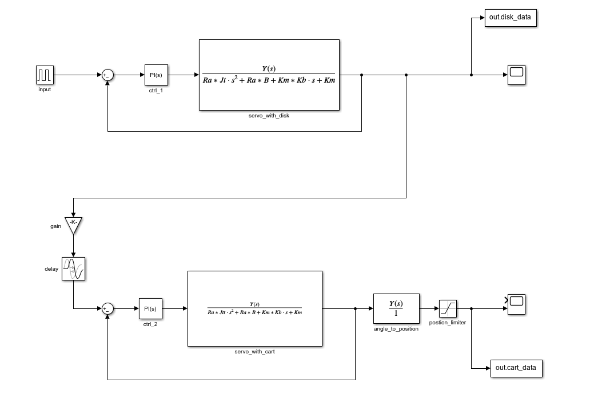

# AC-Servo_Systems

Given a video, the simulation of two systems using AC-Servo motors are created with the help of matlab and control theory concepts.

## Overview

- System 1: Simulating a AC-Servo motor attached to a disk, where the postition model of the motor is used to simulate a quick stop of 50[ms].

- System 2: Simulating a AC-Servo motor attached to a lead screw, where a cart is attached on top of. By using the postion servo model, the cart can slide back and forth for a variety of position intervals.

- Together, the cart system goes through the disk during its short stop for the entire simulation period.

## Servo Motor Transfer Function

  

## Parameter Data

<table>
  <tr>
    <th>Parameter</th>
    <th>Value</th>
  </tr>
  <tr>
    <td>Km ()</td>
    <td>0.8</td>
  </tr>
  <tr>
    <td>Ra</td>
    <td>1.5</td>
  </tr>
  <tr>
    <td>B</td>
    <td>0.25</td>
  </tr>
  <tr> 
    <td>Kb</td>
    <td>0.25</td>
  </tr>
    <td>La</td>
    <td>0</td>
  <tr>
</table>

## Final System Model

  

## Comments

* "AC-Servo Systems.pdf" in the documentation path provides more insight on the project, the parameters, and the design choices made.

* "ac-servo.m" contains parameter intializations as well as plot creations. It is expected to run the script before running the Simulink simulation.

* Running the script after the simulation simply creates the figure/plots.